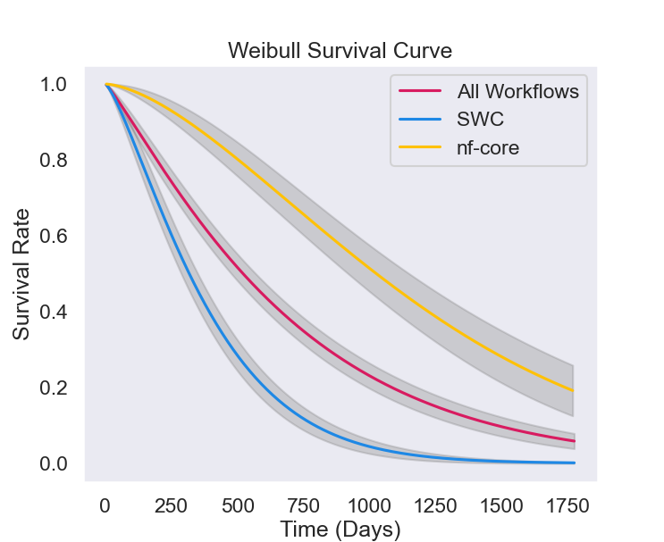

---
# pandoc -i README.md -o README.pdf --standalone --filter=pandoc-crossref --citeproc --number-sections --strip-comments
title: How to enable inexpensive reproducibility for computational experiments
author: Samuel Grayson
date: 2024 Oct 03
bibliography: zotero.yaml
geometry:
- top=1.5in
- bottom=1.5in
- left=1.5in
- right=1.5in
number-sections: true
colorlinks: true
link-citations: true
---

# Problem

Reproducibility is essential to scientific experiments for three reasons:

1. The scientific community corrects false claims by scrutinizing.
   Scurtinizing an experiment often involves reproducing it, possibly with novel parameters.
   A reproducible experiments is easier to scrutinize, and therefore more likely to be correct, all else equal.

2. Science works by building off of the work of others.
   Extending one's work requires executing a modified version of their experiment.
   If reproducing the same experiment is difficult, one would expect executing an extended version to be even more so.
   Therefore, reproducible experiments may be easier to extend.

3. Scientific research aims to impact practice.
   Applying a novel technique to new data involves reproducing a part of the experiment that established the novel technique.
   Therefore, reproducible experiments may be easier to apply in practice.

<!-- TODO
Popper defined reproducibility as a criterion for distinguishing between science and pseudoscience (Hill, 2019 in https://arxiv.org/pdf/2402.07530).
-->

Reproducibility also has costs, primarily in human labor needed to explain the experiment beyond that needed to disseminate the results.
Working scientists balance the cost of reproducibility with the benefits to society or to themselves.

In real-world experiments, an infinitude of possible factors must be controlled to find the desired result; it would be unfathomable that two instantiations of an experiment could give identical results.
In contrast, for computational science experiments (from here on, **CS Exp**) on digital computers, while there are still many factors to control, perfect reproduction is quite fathomable.
Despite this apparent advantage, CS Exps on digital computers still suffer low reproducibility rates.

{#fig:effort width=50%}

The status quo will not change simply by arguing for reproducibility; those arguments are widely known are already taken into account by the efficient market.
Nor do the authors have the power to change incentives in science funding policy unilaterally.
However, by reducing the cost of reproducibility, scientists may achieve greater reproducible with the same effort ([@fig:effort]).
Reducing the cost is a technical problem this work attempts to solve.

For this work, "computational scientist" (from here on, **CS**) should be construed broadly: anyone who uses research software in the process of inquiry.
The term includes people who use research software for data analytics and simulations, so long as scrutinizability, extensibility, and applicability are motivators.
The term applies to professors in academia as well as analysts in a national lab.

# Background

There have been conflicting sets of definitions for the term *reproducibility* [@plesserReproducibilityVsReplicability2018].
In this work, we use the Association for Computing Machinery (from here on, **ACM**) definition, if unspecified, although we discuss the other definitions in the prior work section.
The ACM gave a compatible definition,

> **Reproducibility**:
> (different team, same experimental setup)
> The measurement can be obtained with stated precision by a different team using the same measurement procedure, the same measuring system, under the same operating conditions, in the same or a different location on multiple trials.
>
> --- [@acminc.staffArtifactReviewBadging2020]

Reproducibility contrasts with **repeatability** (same team, same experimental setup) and **replicability** (different team, different experimental setup).

The ACM definition references more useful auxiliary terms, such as measurement procedure, operating conditions, and stated precision, so we use that for this work.

Naïvely, every CSE would be "reproducible", since there is some, possibly unknown, set of conditions under which another team can make the measurement; i.e., "make your environment bit-wise the same as ours".
To prevent the definition from being vacuous, we only consider *explicitly stated* operating conditions.

<!-- TODO:

The relevant question is not "is this CSE reproducible?"; nearly every CSE is reproducible (i.e., the result *can* be obtained in very specific conditions).
The relevant question is, "in what conditions is this CSE reproducible"?

Conditions := set of pairs of configuration and value.
One element might be {("what are the contents of file.txt", "hello world"), ...}

Consider reproducibility over time

Software archival makes conditions more "satisfiable"; the current definitions don't really model this well.

What about the how much effort to rerun question? THe current definition is binary, so it doesn't encode "how hard".

-->

These definitions derive from *metrology*, the science of measuring.
We specialize some of the terms "measurement", "measurement procedure", and "operating conditions" in software context for computational science experiments:

- **Measurement procedure (for CSEs)**:
  The application code and user-interactions required to run the application code (if any).

- **Operating conditions (for CSEs)**:
  A set of conditions the computer system must implement to run a certain program.
  E.g., GCC 12 must be installed at `/usr/bin/gcc` compiled with certain features enabled.

  One may over-specify operating conditions without changing the reproducibility status.
  E.g., one might say their software requires GCC 12, but really GCC 12 or 13 would work.
  It can be difficult and often not necessary to know the necessary-and-sufficient set of operating conditions, so in practice, we usually have set of conditions that is sufficient but not necessary to operate the experiment.

  Operating conditions can be eliminated by moving them to the measurement procedure.
  E.g., the program itself contains a copy of GCC 12.
  For the purposes of this work, the operating conditions are the "manual" steps that the user has to take to use the measurement procedure to make the measurement.

- **Measurement (for CSEs)**:
  Rather than offer a definition, we give some examples:

  - **Crash-freedom**: program produces result without crashing.
  - **Bit-wise equivalence**: output files and streams are bit-wise identical.
  - **Statistical equivalence**: overlapping confidence intervals, statistically consistent conclusions.
  - **Inferential equivalence**: whether the inference is supported by the output.
  - **Semantic equivalence**: equivalent according to the semantics of the defined data type (e.g., semantics of XML disregards whitespace in some contexts).

  In general, it is difficult to find a measurement that is both easy to assess and scientifically meaningful ([@tbl:measurements]).

  \renewcommand{\arraystretch}{1.5}

  | Measurement             | Easy to assess                            | Scientifically meaningful                          |
  |-------------------------|-------------------------------------------|----------------------------------------------------|
  | Crash-freedom           | Yes; does it crash?                       | Too lenient; could be no-crash but opposite result |
  | Bit-wise equivalence    | Yes                                       | Too strict; could be off by one decimal point      |
  | Statistical equivalence | Maybe; need to know output format         | Maybe; need to know which statistics *can* be off  |
  | Inferential equivalence | No; need domain experts to argue about it | Yes                                                |
  | Semantic equivalence    | Depends on the semantics                  | Possibly                                           |

  : Measurments and their attributes. {#tbl:measurements}

  \renewcommand{\arraystretch}{1}

- **Composition of measurement procedures**:
  The outcome of one measurement may be the input to another measurement procedure.

  Composition happens in CSEs as well as in physical experiments.
  In physical experiments, one may use a device to calibrate (measure) another device, and use that other device to measure some scientific phenomenon.
  Likewise, In CSE, the output of compilation may be used as the input to another CSE.
  One can measure a number of relevant properties of the result of a software compilation.
  Composition of build processes motivates the following measurements

  - **Source equivalence**: compilation used the same set of source code as input.

  - **Behavioral equivalence**: the resulting binary has the same behavior as another one.

  - **Bit-wise equivalence**: As before, the binary is exactly the same as another one.

  E.g., suppose one runs `gcc main.c` on two systems and one system uses a different version of `unistd.h`, which is `#included` by `main.c`.
  The process (running `gcc main.c`) does not reproduce source-equivalent binaries, but it might reproduce behavior-equivalent binaries or bit-wise equivalent binaries (depending on how different `unistd.h`).

<!-- TODO: Find an appropriate place for the following ideas:

- Differentiate between "non-determinism" (hampers repeatability) and non-portability (hampers reproducibility, but not repeatability)
- Explain cost-benefit from researchers' perspective
- Technology adoption model (Davis 1989)
- "Computational experiment" should also be construed broadly, as any computational process for which, the first time it is run, learning the result contributes to knowledge.
  A script that starts up a web server is not a computational experiment, but a script that computes the mean of novel data on human weight is.
- Most scientists use research software, and many write their own (Hettrick); therefore, methods for reproducible software are important.
- Buckheit and Donoho: "An article about computational sci- ence in a scientific publication is not the scholarship itself, it is merely advertising of the scholarship. The actual scholarship is the complete software development environment and the complete set of instructions which generated the figures."
- Anecdotes
  - Reinhart and Rogoff corrected by Herndon et al., 2014 because source availability.
  - A scientist's nightmare (Miller, 2006)
  - Dispute between two fluid dynamics groups referenced by Hinsen
  - retraction of two papers from the Lancet and New England Journal of Medicine (Piller and Servick, s. d.). Both studies influenced international policies regarding the use of certain drugs, and they had to be quickly retracted. -- https://arxiv.org/pdf/2402.07530
  - Neil Ferguson's COVID model (Ferguson et al., 2020), for which (Pouzat,022) prepared a humorous article highlighting the scandal caused by the nonpublication of Ferguson's initial code. -- https://arxiv.org/pdf/2402.07530

-->

# Related work

There are many related works that address reproducibility.
We leverage the definitions and framework discussed above to contextualize each work.
Still, there are significant gaps in prior work that this work exploits.
Prior work can be divided into these categories, which we investigate in turn:

1. Characterizing reproducibility in theory or in practice
2. Studying approaches associated with proactively ensuring reproducibility
<!--
3. Studying approaches associated with reactively restoring reproducibility
-->

<!-- TODO:
Overall, we encourage "defense-in-depth" approach that addresses reproducibility from multiple angles.

Synergies exist between multiple approaches.

Metastudies?

Reproducibility, Replicability, and Repeatability: A rvey of reproducible research with a focus on high performance computing by Antunes and Hill https://arxiv.org/abs/2402.07530
--->

## Characterizing reproducibility

Several prior works attempt to characterize reproducibility in theory or in empirical data.

### Characterizing reproducibility in theory

Theoretical characterization begins by defining reproducibility.

Claerbout and Karrenbach give,

> Running the same software on the same input data and obtaining the same results

> --- [@claerboutElectronicDocumentsGive1992]

which many other works use.
Replicability was defined later as

> Writing and then running new software based on the description of a computational model or method provided in the original publication, and obtaining results that are similar enough
>
> --- [@rougierSustainableComputationalScience2017]

The ACM opted to use the terms as they were defined in metrology, which resulted in the same definitions being applied to opposite words as Claerbout and Karrenbach [@herouxCompatibleReproducibilityTaxonomy2018, @plesserReproducibilityVsReplicability2018].
However, the ACM revised their definitions to be compatible with Claerbout and Karrenbach in 2020 [@acminc.staffArtifactReviewBadging2020], so the definitions are mostly in consensus.

<!-- TODO:
Patil et al. clarify these definitions and model them mathematically in a (\\sigma)-algbera [@patilStatisticalDefinitionReproducibility2016].
-->

### Empirical characterization of reproducibility

This group of related work seeks to characterize the degree of reproducibility or a proxy for reproducibility in a sample of CSEs empirically ([@tbl:empirical]).
A proxy variable could be "whether the source is available", since this is a necessary but not sufficient condition for reproducibility.

| Publication                                   | N                | Subjects           | Population                     | Repro measurement assessed or proxy variable | Level        |
|-----------------------------------------------|------------------|--------------------|--------------------------------|----------------------------------------------|--------------|
| @vandewalleReproducibleResearchSignal2009     | 134              | Article artifacts  | 2004 ed. of img. proc. journal | Code availability                            | 9%           |
| @zhaoWhyWorkflowsBreak2012                    | 92               | Taverna workflows  | myExp. 2007 -- 2012            | Crash-free execution                         | 29%          |
| @collbergRepeatabilityComputerSystems2016     | 508[^cb-note]    | Source code        | 2012 eds. of CS journals       | Crash-free compilation                       | 48%          |
| @gundersenStateArtReproducibility2018         | 400              | Article artifacts  | 2013 -- 2016 AI journals       | Sufficient description                       | 24%[^o-note] |
| @pimentelLargeScaleStudyQuality2019           | 863,878[^p-note] | Jupyter notebooks  | GitHub                         | Same-stdout execution                        | 4%           |
| @krafczykLearningReproducingComputational2021 | 5                | Articles artifacts | Journal of Comp. Phys.         | Figures and tables semantic equivalence      | 70%[^v-note] |
| @wangAssessingRestoringReproducibility2021    | 3,740[^w-note]   | Jupyter notebooks  | GitHub                         | Crash-free execution                         | 19%          |
| @trisovicLargescaleStudyResearch2022          | 2,109[^t-note]   | R scripts          | Harvard Dataverse              | Crash-free execution                         | 12%          |

: Prior works characterizing empirical reproudcibility. {#tbl:empirical}

[^cb-note]: We consider the total sample to be only those papers whose results were backed by code, did not require special hardware, and were not excluded due to overlapping author lists, since those are the only ones Collberg and Proebsting attempted to reproduce. I am considering OK<30 and OK>30 as "reproducible crash-free building" because codes labelled OK>Author were not actually reproduced on a new system [@collbergRepeatabilityComputerSystems2016].

[^t-note]: We consider the total samples to be the set of *un-repaired* codes, since those are the ones that actually exist publicly. Also, we *include* codes for which the time limit was exceeded; reproduction was attempted and not successf in those conditions.

[^p-note]: We consider the total sample to be only notebooks that were valid, pure Python, and had an unambiguous order, since those are the ones Pimentel et al. attempt to reproduce [@pimentelLargeScaleStudyQuality2019.]

[^w-note]: We consider the total sample to be only notebooks that had dependency information and used Python 3.5 or later, since those are the only ones Wang et al. attempted to reproduce [@wangAssessingRestoringReproducibility2021].

[^o-note]: This figure is the average normalized "reproducibility score", based on whether the method, data, and experiment, were available. If it were 1, all the papers in the sample would be have method, data, and experiment availability, and if it were 0, none would be.

[^v-note]: This figure is the average number of computational elements (figures and tables) that wereeproduced to semantic equivalence in each paper.

Note that crash-freedom is prevalent because it is the easiest to automatically assess.
Source-availability requires human-intervention to test, so studies on crash-freedom simply begin from a corpus for which source code is available.
Note that stdout-equivalence is feasible because Jupyter Notebooks bundle the stdout with the code; otherwise, the stdout is usually thrown away.

Overall, these studies show that reproducibility is a significant problem.

Some of the studies, like Zhao et al., investigate the *reason* why some samples were not reproducible [@zhaoWhyWorkflowsBreak2012], finding

| Reason                                      | Proportion of failures |
|---------------------------------------------|------------------------|
| Unavailable/inaccessible 3rd party resource | 41%                    |
| Updated 3rd party resource                  | 7%                     |
| Missing example data                        | 14%                    |
| Insufficient execution environment          | 12%                    |
| Insufficient metadata                       | 27%                    |

@zhaoWhyWorkflowsBreak2012 remark that provenance could preserve or enable repair for several classes of failures, including unavailability of 3rd party resources and insufficient descriptions.
We investigate this approach in my proposed work.

## Proactively ensuring reproducibility

There are several proposed approach associated with proactively facilitating reproducibility:

| Approach                        | Aspect of reproducibility addressed         |
|---------------------------------|---------------------------------------------|
| Scientific clouds               | Reduces non-portable operating condions     |
| Source artifact archival        | Ensure attainability of operating condition |
| Workflow managers               | Simplify measurement procedure              |
| Provenance                      | Identifies operating conditions             |
| Record/replay executions        | Reduces operating conditions                |
| Virtualization/containerization | Reduces non-portable operating conditions   |
| Digital notebooks               | Explicates measurements                     |

<!-- TODO:
Remove source artifact archival

| Package managers                | Reduces non-portable operating conditions      |
| Seeding inputs                  | Reduces non-deterministic operating conditions |
| Coding practices                | Reduces non-deterministic operating conditions |
| Version control                 | Versions and distributes measurement procedure |
-->

<!-- TODO: Ensure matches between table and headings -->

## Scientific clouds

Scientific clouds facilitate reproducibility by replacing a complex set of operating conditions ("install this, configure that") with a single opeting condition: log in to a cloud system.
The cloud system hosts a controlled environment with t rest of the operating conditions already met.

However, storing the environments and running executis in them is expensive.
Either the users have to pay, in which case the computational environment is not "freely accessible", orome institution may sponsor public-access.
Institutional grants for public-access may be indefinite or it may only last for a certain aunt of time due to funding constraints ([@tbl:sci-clouds]).

\renewcommand{\arraystretch}{1.5}

| Scientific Cloud              | URL                  | Lifetime on Archive.org | Main publication                                    |
|-------------------------------|---------------------------|-------------------------|----------------------------------------------|
| Binder                        | mybinder.org         | 2018 -- present         | @jupyterBinder20Reproducible2018                    |
| Chameleon Cloud (federated)   | chameleoncloud.org   | 2015 --resent           | @keaheyLessonsLearnedChameleon2020                  |
| PhenoMeNal portal             | phenomenal-h2020.eu  | 2017 -- 2023            | @petersPhenoMeNalProcessingAnalysis2019             |
| WholeTal                      | WholeTale.org        | 2016 -- present         | @brinckmanComputingEnvironmentsReproducibility2019a |
| GridSpace2                    | gs2.plgrid.pl        | 2015 -- 2020            | @ciepielaGridSpace2VirtualLaboratory2012            |
| Collage Authoring Environment | collage.elsevier.com | 2013 -- 2014            | @nowakowskiCollageAuthoringEnvironment2011          |
| RunMyCode                     | RunMyCode.org        | 2012 -- 2024            | @stoddenRunMyCodeorgNovelDissemination2012          |
| SHARE                         |                      | 2011 -- 2023            | @vangorpSHAREWebPortal2011                          |
| Galaxy (federated)            | usegalaxy.org        | 2007 -- present         | @thegalaxycommunityGalaxyPlatformAccessible2024     |
| GenePattern                   | GenePattern.org      | 2006 -- present         | @reichGenePattern202006                             |

: Various scientific clouds found in prior work, by creation date. {#tbl:sci-clouds}

\renewcommand{\arraystretch}{1}

An improvement on this model is the *federated model* (as in @thegalaxycommunityGalaxyPlatformAccessible2024), where the compute infrastructure could be provided by multiple parties which themselves may be free-access, pay-for-access, or locally hosted servers.
So long as the user can reserve compute resources on any *one* of them, they can import and run the CSE.
Federation doesn't alleviate the funding problem, but it does spread out the funding problem; if the original grant runs out, some other institution can pick up the torch.
If all else fails, technically savvy individuals can run servers for just themselves (so-called "self-hosting").
However, federation trades off with standardization and consistency; a CSE may only work with certain infrastructure providers.

<!-- TODO: Place the following:

- Chameleon Cloud
- Google Colab
- GalaxyHub.eu
- Gentleman & Temple Lang’s Research Compendium
- G. R. Brammer, R. W. Crosby, S. Matthews, and T. L. Williams. Paper mch: Creating dynamic reproducible science. Procedia CS, 4:658–667, 2011. -->

### Literate programming and digital notebooks

The idea of literate programming according to Knuth is to mix narrative and explanation into code.

> Instead of imagining that our main task is to instruct a computer what to do, let us concentrate rather on explaining to human beings what we want a computer to do.
>
> --- [@knuthLiterateProgramming1984]

Digital notebooks or electronic lab notebooks extend this to also include multimedia, such as graphs, widgets, and other data visualizations.
Popular digital notebooks include:
Jupyter, Amazon Sagemaker, Google Colab, Deepnote, Hex, Databricks Notebooks, DataCamp Workspace, JupyterLab, HyperQuery, Jetbrains Datalore, kaggle, NextJournal, Noteable, nteract, Observable, Query.me, VS Code notebooks, Mode Notebooks, Querybook, Zeppelin, Count, Husprey, Pluto.jl, Polynote, Zepl^[List at <https://datasciencenotebook.org/>].

Digital notebooks facilitate reproducibility by:

- encoding the measurement itself, which may otherwise be printed to `stdout` and not distributed.
- encoding the explanation for the measurement procedure, making it easier to adapt if errors or difference arise.
- automating data analysis steps that would otherwise by typed into an interpreter and n saved.

However, digital notebooks still require a separate way of specifying the software environment (operating conditions).
Repo2docker, famously used by the scientific cloud Binder, standardizes a way of specifying the software environment for notebooks contained in a repository by leveraging off-the-shelf package managers [@jupyterBinder20Reproducible2018].
We discuss package managers as a solution foreproducibility later on; the pointtill stands that literate programming requires other methods to manage the soware environment in order to attain reproducibility.

<!-- TO:

- Ten Simpleules for Reproducible Research in Jupyter Notebooks by Rule et al. https://arxiv.org/abs/1810.08055
- Binder
- S. Li-Thiao-T. Literate program execution for reproducible research and executable papers. Procedia CS, 9:439–448, 2012
- D. Koop, E. Santos, PMates, H. T. Vo, P. Bonnet, B. Bauer, B. Surer, M. Troyer, D. N. Williams, J. E. Tohline, J. Freire, and C. T. Silva. A provenance-based infrastructure to support the life cycle of executable papers. Procedia CS, 4:648–657, 2011 -->

### Source code archival

Source code archives ([@tbl:source-archival]) facilitate reproducibity by making operating conditions namable and satisfiable.
Giving software and software versions a unique identifier makes the operating conditions explicitly namable.
Namability approaches include Digital Object IdentifiersDOI), Archival Resource Key (ARK), Uniform Resource Names (URNs), and persistt URLs (PURLs).

<!-- TODO: Citations or table

https://arks.org/
-->

Archiving old versions of core software helps conditions remain satisfiable, since old versions may otherwise get deleted or become unfindable.

\renewcommand{\arraystretch}{1.5}

| Source Code archive       | Description                     | Lifetime        | Main publication                       |
|---------------------------|---------------------------------|-----------------|----------------------------------------|
| Software Heritage Archive | Collects codes in other sources | 2016 -- present | [@dicosmoCuratedArchivingResearch2020] |
| Zenodo                    | User-uploaded research codes    | 2013 -- present | [@siciliaCommunityCurationOpen2017]    |
| FigShare                  | User-uploaded research codes    | 2012 -- present | [@singhFigShare2011]                   |

: Source Archives by creation date. {#tbl:source-archival}

\renewcommand{\arraystretch}{1}

Storing source code in central archives shares some of the disavdantages of scientific clouds, but to a lesser extent.
Merely storing scientific software is much easier than offering to execute them on-demand.
Indeed, all of the source archival solutions we found in prior literature are still alive today; the same cannot be said for scientific clouds.

While source code archival does help with unfulfillable conditions, it still requires someone or something to actually set up, configure, build, and install the source code to actually satisfy the condition "install this version of that software".
Other methods should work in concert, falling back on source code archival if the code is no longer available from the original hoster.

### Workflow managers

A workflow manager is a system that executes a directed acyclic graph of loosely coupled, coarse nodes.
Usually, each node is a process and each edge is a file.

Workflow managers facilitate reproducibility by:

- Explicitly stating parts of the measurement procedure that would otherwise be unwritten (which script to run, in what order)
- Letting systems reason about the inputs and outputs of the measurement procedure

Mölder et al. [@molderSustainableDataAnalysis2021] give classify workflow engines by their interface ([@tbl:wfs]) which we extend.
The interface can be graphical, a library in a general purpose language (GPL), a domain specific language (DSL), or a data definition language (such as YAML).
We reclassified the workflow managers in Mölder's system-independent class, since that does not refer to the interface, and we added other common workflow managers that have more than 1 workflow example in the registries listed in <https://workflows.communities/registries>

| Workflow Manager                         | Interface                |
|------------------------------------------|--------------------------|
| Galaxy                                   | Graphical                |
| KNIME                                    | Graphical                |
| Scipion                                  | Grpahical                |
| COMPS (in Java)                          | Library in GPL           |
| Parsl (in Python)                        | Library in GPL           |
| Dask (in Python)                         | Library in GPL           |
| Pegasus (in Python, Java, R)             | Library in GPL           |
| Luigi (in Python)                        | Library in GPL           |
| Nextflow                                 | DSL                      |
| Snakemake                                | DSL                      |
| Workflow Description Language (WDL)      | DSL                      |
| Bpipe                                    | DSL                      |
| Common Workflow Language (CWL) (in YAML) | Data Definition Language |

: Common workflow managers classified by interface. More available here: <https://github.com/meirwah/awesome-workflow-engines> {#tbl:wfs}

<!-- KNIME: bertholdKNIMEKonstanzInformation2009 -->

Additionally, there are other ways to classify workflows, including parallelism (task, data, both, neither), static vs dynamic scheduling [@liuSurveyDataIntensiveScientific2015].
Workflows can be subjectively evaluated based on clarity, well-formedness, predictability, recordability, reportability, reusability, scientific data modelling, and automatic optimization [@mcphillipsScientificWorkflowDesign2009].

<!-- | Taverna                             | Graphical      |                  | -->
<!-- | Kepler                              | Graphical      |                  | -->
<!-- | GeneProf                            | Graphical      |                  | -->
<!-- | SciPipe (in Go)                     | Library in GPL |                  | -->
<!-- | Airflow (in Python)                 | Library in GPL |                  | -->
<!-- | GNU Make                            | DSL            |                  | -->
<!-- | Popper                              | Declarative    |                  | -->
<!-- | WINGS                               | Declarative    |                  | -->

Workflow managers often represent a departure from what the user is currently doing, and therefore take significant effort to adopt.
Aditionally, workflow managers introduce another dependency which needs to be managed with another reproducibility strategy.

<!-- TODO:

- Connection between workflow and provenance -->

### Provenance

Computational provenance (henceforth, **provenance**) is the processes that generated a computational artifact, the inputs to that provenance, and the provenance of those inputs (recursively) [@freireProvenanceComputationalTasks2008].
Provenance facilitates reproducibility by explicitly stating the inputs (operating conditions).

There are four levels at which one can capture computational provenance [@freireProvenanceComputationalTasks2008] ([@tbl:provs]):

- **application-level**: modifying an application to report provenance data.
- **workflow-level** or **language-level**: leveraging a workflow engine or programming language to report provenance data.
- **system-level**: leveraging an operating system to report provenance data.
- **service-level**: recording provenance at the boundaries between services in a system.

| Provenance system | Level                           |
|-------------------|---------------------------------|
| REDUX             | Workflow-level                  |
| Swift             | Worfklow-level                  |
| VisTrails         | Workflow-level                  |
| Kepler            | Workflow-level                  |
| Taverna           | Workflow-level                  |
| PASS              | System-level                    |
| ES3               | System-level                    |
| Sumatra           | System-level                    |
| PASOA             | Service-level                   |
| Karma             | Workflow-level or service-level |
| noWorkflow        | Language-level                  |

: Provenance capturing systems for CSE in prior work. {#tbl:provs}

More provenance systems and classifications are discussed in the First Provenance Challenge [@moreauSpecialIssueFirst2008].

<!-- TODO: GO back and check service-level meaningful -->

Most of these provenance systems are implemented at a workflow-level or service-level, so they are only applicable to users of that workflow or service.
System-level could be more generally usable by any program running in that system.
However, neither Sumatra, PASS, nor ES3 leverage the provenance to create automatic replay.
These methods help reproducibility, but they do not deliver "push button" reproducibility, which we need to extract the maximum value from the minimum amount of work.

noWorkflow attempts to capture provenance for arbitrary Python programs [@murtaNoWorkflowCapturingAnalyzing2015].
Python provenance could be useful for projects whose data processing is primarily Python, however it would not be able to track data past that boundary.

### Record/replay tools

Record/replay is a feature where the user executes an unmodified program in a "record" environment, which creates a reproducibility package.
The reproducibility package can be stored or distributed, and later on, the user can "replay" the same execution from it.

| Record/replay | Capture method        |
|---------------|-----------------------|
| CDE           | Ptrace                |
| RR            | Ptrace                |
| CARE          | Ptrace                |
| Sciunit       | Ptrace                |
| ReproZip/PTU  | Ptrace                |
| OPUS          | Library interposition |
| PROV-IO       | Library interposition |
| bpftrace      | eBPF                  |
| PASS          | Kern. mod.            |
| CamFlow       | Kern. mod.            |

While record/replay is a convenient user-interface, none of the implementations are fast and run without super user.
Scientific users rarely have super user privileges on shared hardware; root "in container" is not strong enough to install kernel modules or eBPF programs.
The overhead of conventional record/replay tools is often more than 2x, making them infeasible to use in many cases.

One might argue that record/replay "allows" users to be messy and merely preserves the mess perfectly [@douglasthainTechniquesPreservingScientific2015].
Simply copying the entire filesystem, for example, may work (the operating conditions are likely contained in the filesystem), but an entire filesystem inconvenient to transfer, compose, and execute.
An ideal record/replay tool should allow users to introspect and simplify their computational environment.

### Virtualization and containerization

System virtualization facilitates reproducibility by encapsulating an entire system (and thus its operating conditions) in a distributable sandbox.
System virtualization drivers include QEMU, VirtualBox, VMWare Fusion, Parallels for Mac, etc.

Containerization is similar, but it only encapsulates Linux userspace, reusing the hosts Linux kernel.
On non-Linux hosts, the container is nested inside a virtualized Linux instance.
Containerization has weaker isolation than system virtualization but better performance and lower storage.
Container engines include Docker, Podman, and Singularity.

In either case, either the system image has to be distributed (VM image, Docker image, etc.) or instructions to build the system image (e.g., `Vagrantfile`, `Dockerfile`, `Singularityfile`, etc.).

- Distributing the image is difficult because it is large, expensive to store, and expensive to transfer.
  DockerHub, a popular storage space for Docker images, recently changed their policy to remove images that had not been pulled or pushed in the past six months [@demorlhonScalingDockersBusiness2020], although enforcement was delayed until 2021 [@demorlhonDockerHubImage2020].
- The build instructions, although easy to distribute, require *another* reproducibility strategy to be reproducible.
  It simply redirects the problem of CSE irreproducibility to Docker image irreproducibility.

<!--
https://par.nsf.gov/servlets/purl/10324363
-->

<!--

### Package managers

- How do package managers connect to reproducibility 
  - Nix
  - Guix
  - Spack

-->

<!--

### Source sharing

Why not share source, according to C&P?

-->

<!--

### Version control

### Metastudies

- Lazaro Costa 
  - https://dl.acm.org/doi/10.1145/3641525.3663623 -->

<!--

## Retroactively restoring reproducibility

Reproducibility is difficult to restore once it is lost, but there are some automated and semi-automated (human-in-the-loop) methods in prior work:

| Name   | Target                | Method            | Citation                             |
|--------|-----------------------|-------------------|--------------------------------------|
| PyDFix | Python package builds | Expert heuristics | @mukherjeeFixingDependencyErrors2021 |
|        |                       |                   |                                      |

https://ieeexplore.ieee.org/stamp/stamp.jsp?arnumber=9307725&casa_token=Efe38IMFj7sAAAAA:5Cvrp5KzeprUNrVcwd3I8etGp7sTfeyPxebFyXPa0HEYXWBfQlnI2nLaAwkjvnc-498JFIqq
https://ieeexplore.ieee.org/stamp/stamp.jsp?arnumber=8811897&casa_token=pcckfEMu0WgAAAAA:in5Y9TCMKkaAHMGB5HKm3gk3HjiwasFNYXe58tX_CijHHQz2Ith3mQ1K1FLD0wd_nBI3H_Fz
https://dl.acm.org/doi/pdf/10.1145/3293882.3330578?casa_token=r9rLbfI9iwEAAAAA:s72yb5cu734qtclNOMyillGweYvQ1QtGuCJP8rEr8a4aCDsPeXdQjbSVxlnu5oysMvYXyqJpQ6o
https://rebels.cs.uwaterloo.ca/papers/saner2018_macho.pdf
https://ieeexplore.ieee.org/stamp/stamp.jsp?arnumber=8952262&casa_token=2TOq450ADjIAAAAA:EogvCgxErcxSzjOIZ1JEybMSMPKf-XY8tat_GzOjB5pyC4JF3uIzoVW__YVMbmug34Dr2MCp&tag=1
https://dl.acm.org/doi/pdf/10.1145/3180155.3180181?casa_token=8zmvHNuOG3MAAAAA:FETTRdUb8N7tglDPXQYwBHGUTiwkl51C1GcYEJrqqEzIlBr1jkQoxoeATXnXRMEdshhXevr5xZ4

- Continuous integration
- Automatic build repair for reproducibility
- Cindy Rubio-Gonzales
- ShipWright
- Jupyter studies

-->

<!--

## Other aspects of reproducibility

- Relationship to replicability
- Definitions/terms
- (Marwick, 2015) highlighted the challenge posed by computer programs: they act as black boxes. -- https://arxiv.org/pdf/2402.07530
- Collberg and Proebsting responses to study
- How to address source code sharing 
  - Collberg and Proebsting responses to code sharing
  - Stodden
  - ACM REP '23 and ACM REP '24 have work on this
  - Incentives 
    - Artifact badging
    - Vandewalle et al.
- FAIR for RSware
- Why does RSE work matter for reproducibility? 
  - Bridging the gaps
- Findability 
  - M. Gavish and D. Donoho. A universal identifier for computational results. Procedia CS, 4:637-647, 2011.
- Software citation
- Publishing modes/executable papers 
  - Research notebooks
  - Semantic description of hypothesis
  - P. V. Gorp and S. Mazanek. Share: a web portal for creating and sharing executable research papers. Procedia CS, 4:589–597, 2011
- J. Kovacevi (check name). How to encourage and publish reproducible research. In IEEE International Conference on Acoustic Speech Signal Processing, volume IV, pages 1273–1276, Apr. 2007.
- Journals 
  - N. Limare. Running a reproducible research journal, with source code inside. In ICERM Workshop, 2012.
  - ReScienceC (Rougier et al. 2017)
  - An increasing number of journals and conferences are concerned with the reproducibility of published articles (Drummond, 2018) (Bajpai et al., 2019).
  - Image Processing On Line (IPOL) [Miguel Colom, Bertrand Kerautret, Nicolas Limare, Pascal Monasse, and Jean-Michel Morel. 2015. IPOL: a new journal for fully reproducible research; analysis of four years development. In 2015 7th International Conference on New Technologies, Mobility and Security (NTMS). IEEE, 1–5.]
- Copyright 
  - V. Stodden. The legal framework for reproducible scientific research: Licensing and copyright. Computing in Science and Engineering, 11(1):35–40, 2009.
- Domain-specific testbeds 
  - Networking guy from ACM REP '24
  - Triscale
- We found one survey providing state-of-the-art reproducibility in scientific computing (Ivie and Thain, 2018), and several books attempting to do so (Desquilbet et al., 2019) (National Academies of Sciences, 2019) (Randall and Welser, 2018). -- https://arxiv.org/pdf/2402.07530
- In his article (Drummond, 2018), Drummond asserted that sharing the source code of an article is unnecessary. He believes that researchers are forced to do so to avoid getting a bad label but that it does not serve science. For him, the reproducible research movement was not based on facts, but only on intuition. He adds that the obligation to provide the source code will lead to papers being accepted based on technically weak criteria and that, according to his opinion, fraud has always existed and never posed a significant problem. However, Drummond supports the concept of open science. -- https://arxiv.org/pdf/2402.07530
- Prior work of https://web.archive.org/web/20220119115703/http://reproducibility.cs.arizona.edu/v2/RepeatabilityTR.pdf
- http://reproducibleresearch.net/ -->

# My research strategy

Good research begins by investigating the empirical evidence and investigating the theoretical underpinnings.
By looking at both, one can begin to identify the problems and solutions.
Empirical study of reproducibility should include not only the rate of ir/reproducibility but the reasons for irreproducibility.
Future work should target only the most common reasons.

A theoretical framework is necessary because there are so many approaches that address reproducibility, it is useful to say what this approach does that the others do not.
I.e., in what sense is the approach "more" reproducible?

System-level provenance can identify the relevant parts of the software environment "for free".
Once the provenance is produced, one can easily create a replication package that can be replayed on any hardware-compatible machine, resembling a record/replay tool for arbitrary programs.

A record/replay tool addresses achieves a high-level of reproducibility, according to our theoretical framework, with a little amount of effort.
Almost no instruction is necessary to reproduce the software.
Not only does record/replay increase reproducibility, it addresses one of the most common reasons against sharing source (difficulty of answering questions about how to reproduce the software).

<!-- TODO: proactive/reactive -->

There are numerous applications for provenance (workflow conversion, incremental computation), <!-- TODO: cite --> so the provenance tracer should connect with existing provenance standards and provenance applications to form a suite of related tools.

Finally, the provenance tracer should be validated through user studies or case studies.
Unexpected problems and invalidated assumptions often arise when trying to convert research into practice [@besseyFewBillionLines2010].
Trying to apply to practice makes my research more impactful and gives me novel problems and assumption-sets to operate in.
<!-- TODO: Cite Translational CS -->

# Completed work

In this section, I outline my completed work on this subject.

## Lifetime of workflows in sample

We attempted to run workflows in two large registries: Snakemake Workflow Catalog (SWC) and nf-core [@graysonAutomaticReproductionWorkflows2023].
Of these, about half had at least one non-crashing revision [@tbl:crashes].
For those whose most recent revision did not crash, we looked how far back we could go before we found a crashing revision.
Evaluating old software today approximates the failure rate of evaluating today's software in the future.
We found that workflows had a median failure rate of a couple of years [@fig:survival].

| Quantity                                               | All | SWC | nf-core |
|--------------------------------------------------------|-----|-----|---------|
| \# workflows                                           | 101 | 53  | 48      |
| \# revisions                                           | 584 | 333 | 251     |
| % of revisions with no crash                           | 28% | 11% | 51%     |
| % of workflows with at least one non-crashing revision | 53% | 23% | 88%     |

: Statistics on workflows in SWC and nf-core. {#tbl:crashes}

{#fig:survival width=50%}

When the workflows failed, we classified the crash reason [@tbl:wf-failures].
The most common kind of crash is simply a missing input.
The workflow manager could not help in this case, because the missing input is not an internal node, but a top-level node, where the workflow manager would read a file from the outside system.
Provenance tracing could help automatically upload inputs that a workflow needs to run.

| Kind of crash                  | Proportion   |
|--------------------------------|--------------|
| Missing input                  | 32%          |
| Conda environment unsolvable   | 11%          |
| Unclassified reason            | 8%           |
| Timeout reached                | 7%           |
| Container error                | 6%           |
| Other (workflow script)        | 6%           |
| Other (containerized task)     | 1%           |
| Network resource changed       | 1%           |
| Missing dependency             | 0.5%         |
| No crash                       | 28%          |
| ------------------------------ | ------------ |
| Total                          | 100%         |

: Workflow failure reasons {#tbl:wf-failures}

## Literature review and evaluation of record/replay tools

We executed a rapid literature review to systematically search for system-level provenance collectors in prior literature [@graysonBenchmarkSuitePerformance2024].
We arrived at a list of 45, and then:

- Selected only thsoe that worked for Linux (39).
- From those, selected those which did not use VMs (37).
- From those, selected those which did not require source-code recompilation (35).
- From those, selected those which did not require special hardware (31).
- From those, selected those which had source code available (20).
- From those, selected those which did not require a custom kernel (15).
- From those, attempted to reproduce 10.
- From those, selected those which successfully completed all of the benchmarks (5): ReproZip, strace, fsatrace, CARE, and RR.

Unfortunately, there is no standard set of benchmarks used to evaluate system-level provenance tracers.
Therefore, we also extracted all of the benchmarks used in any work returned by this search ([@tbl:bmarks]).

| Prior works | This work | Category                                             |
|-------------|-----------|------------------------------------------------------|
| 12          | yes       | HTTP server/traffic                                  |
| 10          | yes       | HTTP server/client                                   |
| 10          | yes       | Compile user packages                                |
| 9           | yes       | I/O microbenchmarks (lmbench + Postmark)             |
| 9           | no        | Browsers                                             |
| 6           | yes       | FTP client                                           |
| 5           | yes       | FTP server/traffic                                   |
| 5           | yes       | Un/archive                                           |
| 5           | yes       | BLAST                                                |
| 5           | yes       | CPU benchmarks                                       |
| 5           | yes       | Coreutils and system utils                           |
| 3           | yes       | cp                                                   |
| 2           | yes       | VCS checkouts                                        |
| 2           | no        | Sendmail                                             |
| 2           | no        | Machine learning workflows (CleanML, Spark, ImageML) |
| 1           | no        | Data processing workflows (VIC, FIE)                 |

: Benchmarks from prior works and this work. {#tbl:bmarks}

Between these five, we ran the extracted benchmarks in the provenance tracers ([@tbl:perf]).
We measured the percent overhead from native case, so a value of 50% means the new runtime would be the native runtime times 1.5.
We can see that none of the existing provenance collectors are fast enough for practical use, except for fsatrace.
The salient difference is that the other provenance tracers use ptrace to capture the underlying calls, while fsatrace uses `LD_PRELOAD`.
ptrace involves four context switches on every system call: one from the tracee to the kernel, one from the kernel to the tracer, one from the tracer to the kernel, and one from the kernel to the tracee.
`LD_PRELOAD` involves *no* extraneous context switches.
Therefore, we build on the underlying technology of fsatrace in our future work.

| Benchmark        | Native | fsatrace | CARE | strace | RR  | ReproZip |
|------------------|--------|----------|------|--------|-----|----------|
| BLAST            | 0      | 0        | 2    | 2      | 93  | 8        |
| Tar Unarchive    | 0      | 4        | 44   | 114    | 195 | 149      |
| Python import    | 0      | 5        | 85   | 84     | 150 | 346      |
| VCS checkout     | 0      | 5        | 71   | 160    | 177 | 428      |
| Compile w/Spack  | 0      | -1       | 119  | 111    | 562 | 359      |
| Postmark         | 0      | 2        | 231  | 650    | 259 | 1733     |
| cp               | 0      | 37       | 641  | 380    | 232 | 5791     |
| Others not shown | ...    | ...      | ...  | ...    | ... | ...      |
|------------------|--------|--------- |------|--------|-----|--------- |
| Geometric mean   | 0      | 0        | 45   | 66     | 46  | 193      |

: Performance of different provenance collectors. {#tbl:perf}

# Proposed work

After having gathered empirical evidence on why CSEs fail to be reproducible and gathered evidence on state-of-the-art provenance tracers, it is time to set off on future work.

## Provenance & Replay Observation Engine (PROBE)

I am working on a novel, system-level provenance tracer that uses `LD_PRELOAD` called PROBE.
The tracer is capable of tracing simple applications and extracting a provenance dataflow graph.
I need to work on:

- tracing more complex applications
- tracing remote applications (by wrapping remote accesses)
- replaying the trace on other machines
- converting the trace to a workflow

I plan to leverage provenance standards such as RO-crates <!-- TODO: cite --> and W3C PROV.

I would evaluate PROBE based on its performance and the set of configuration variables that it isolates in the replay environment.
Both of which will be compared relative to other record/replay tools

Eventually, I want to put PROBE to use in practice at Sandia National Labs, perhaps writing an experience report about translating research into practice.

## Automatic environment manipulation

It is more convenient to *preserve* reproducibility, there are important works for which we must do the more difficult task of *restoring* reproducibility.
In these cases, we can try automated methods to restore reproducibility.
The most obvious thing to try is mutating the software environment and trying again.
Perhaps the approach can be augmented with PROBE, which will reveal which parts of the software environment are being accessed.

A tool that automatically manipulates the software environment could also be used to test the sensitivity of CSEs to software versions.
Prior work shows that changing the software environment has approximately the same effect as changing the rounding mode for their particular CSE [@vilaImpactHardwareVariability2024].
It would be interesting to generalize this to other CSEs.
Perhaps this could even be used as a method to empirically validate uncertainty quantification estimates produced using other methods.

<!-- ## Reproducibility in computer systems research -->

<!--

# Intellectual merit

What is the importance of the activity to advancing knowledge or understanding?

- Validate theoretical model
- Theoretical model systematizes knowledge
- Unique treatment of reproducibility as cost/benefit
- Encourage use of provenance (transformative concept)
- Uniting OS background with TAM and user studies

# Expected impact

What impact can be expected in terms of particular research communities and on society in general?

- "Push button" reproducibility
- Reproducibility helps inclusivity in research in grad school and globally -->

<!--

# Feasibility

How likely are the stated goals to be achieved by the candidate?
-->

## Timeline

- Complete PROBE functionality 2024 Nov 31.
- Deploy PROBE in practice 2024 Jan 31.
- Automatic environment manipulation 2024 Apr 31.
- Collberg & Proebsting reproduction 2024 Apr 31.

# Bibliography

<!--

# Notes

Important dimension to reproducibility approaches:  time.  For how long does a particular approach yield reproducibility?  A Dockerfile that is more than a few months old might not even build.

Converting sys level to human level

Explicitly state what is the same

Robustness to software environment changes

Empirical studies of repro

- Send schehdule
- Send expectations
- Send draft
- Email Tim re PROBE
- Find prior art definitions

-->
